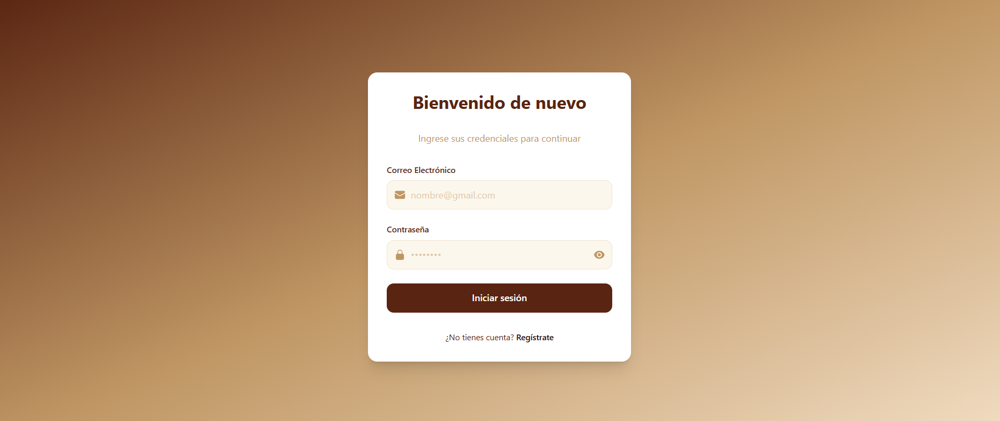
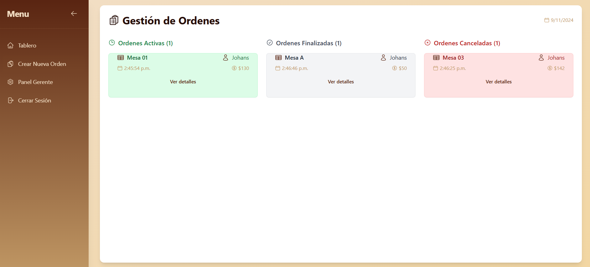
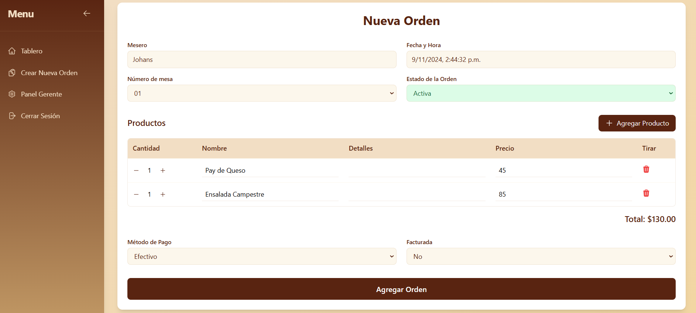
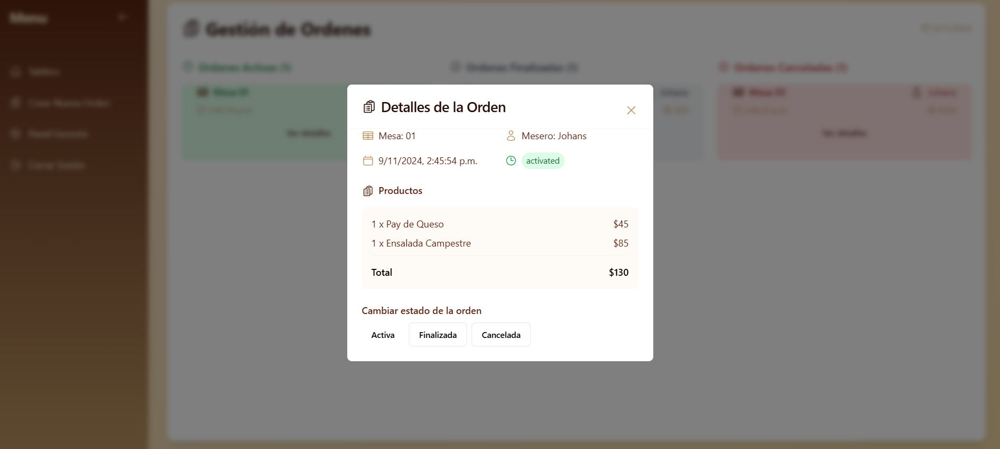
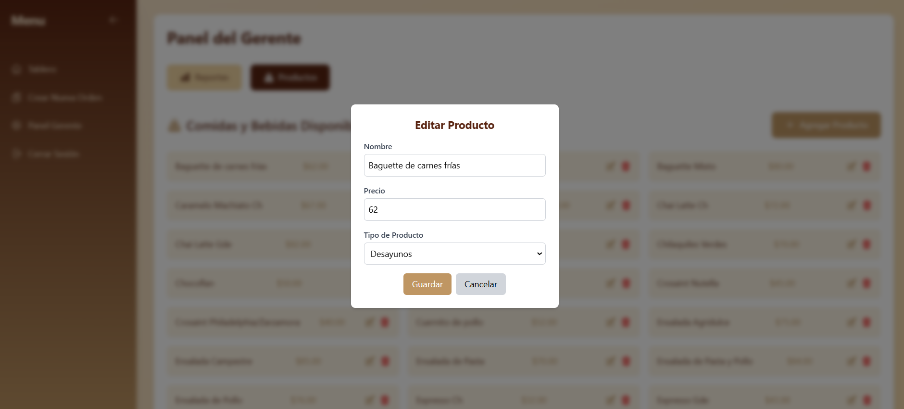
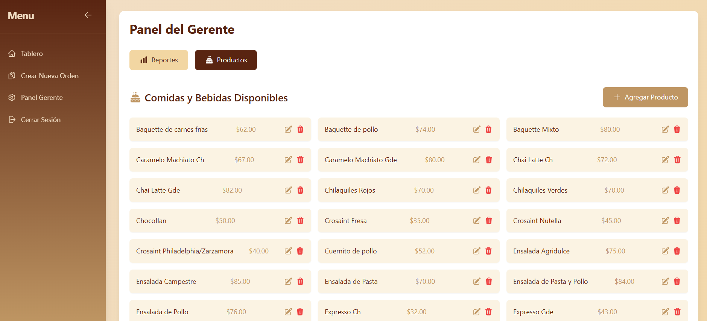
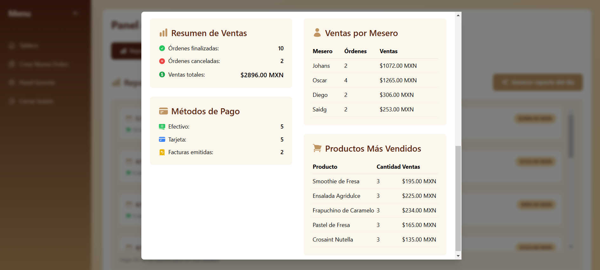
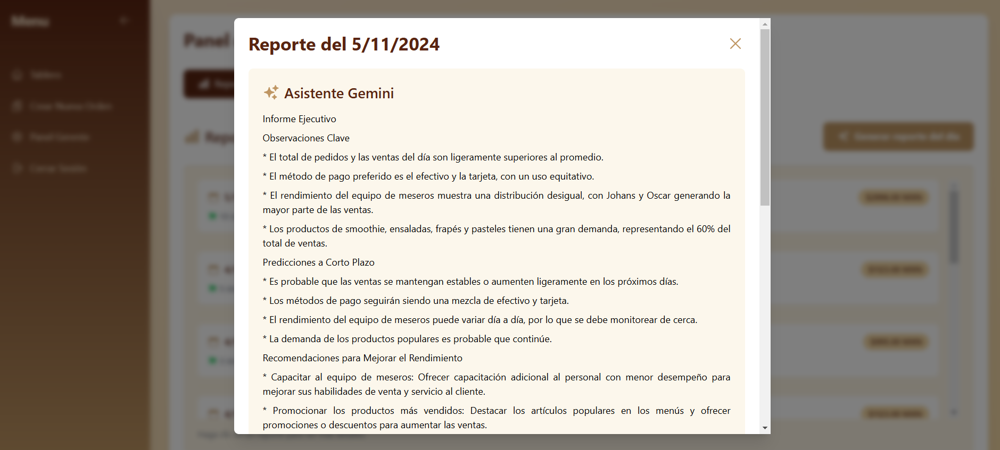
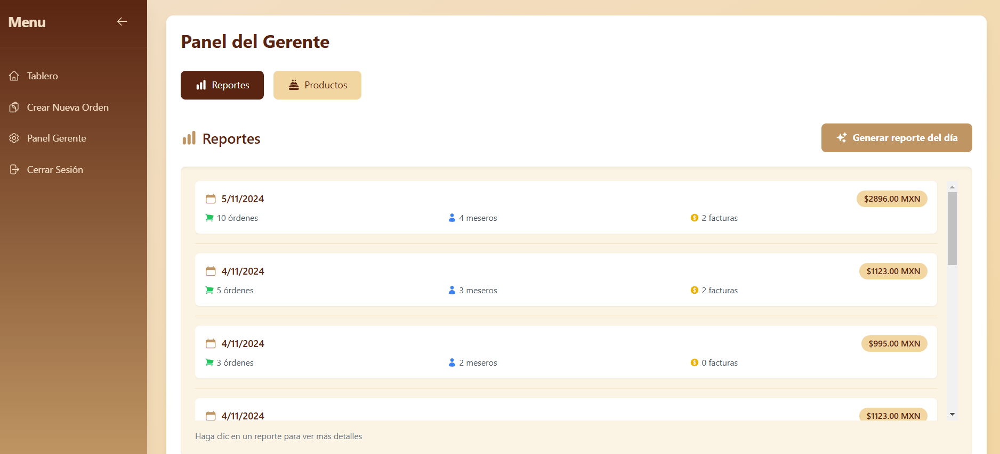

# Sistema de Gestión de Órdenes y Ventas para Cafetería

## Descripción del Proyecto

Este sistema de gestión de órdenes y ventas está diseñado para cafeterías, permitiendo registrar pedidos, gestionar pagos y generar reportes diarios de ventas. Está desarrollado como una **aplicación web**, lo que permite acceder desde cualquier dispositivo con un navegador.

### Funcionalidades principales:

- **Gestión de Órdenes**: Registrar, modificar y cerrar órdenes de clientes de manera rápida y eficiente.
- **Generación de Reportes**:
  - **Diarios**: Resúmenes automáticos de las ventas por día.
  - **Clasificación de pagos**: Reportes de ventas clasificados según el método de pago (efectivo, tarjeta).
  - **Métricas de Ventas**: Total de órdenes realizadas, promedio de ventas por cliente, productos más vendidos.

## Inteligencia Artificial Integrada

El sistema incluye un módulo de **Inteligencia Artificial (IA)** para mejorar la toma de decisiones de los gerentes y optimizar las ventas de la cafetería. Se empleó el Modelo de Generative Language API de Google GEMINI.

### Funcionalidades de la IA:

- **Observaciones Clave**: La IA analiza los patrones de ventas y las métricas del día para generar un infrome detallado.
- **Resumen Creativo de Ventas**: Utilizando procesamiento de lenguaje natural (NLP), la IA genera resúmenes creativos y atractivos de las ventas del día, resaltando los productos más populares y peculairidades del desempeño de los empleados.
- **Análisis Predictivo**: Predice los productos que podrían ser más populares en función de los datos históricos de ventas.

## Demostración del Producto

A continuación, te presentamos un tour visual de las principales interfaces de la aplicación, mostrando sus funcionalidades y características clave.

1. **Inicio de Sesión**

   - Acceso seguro para el personal de la cafetería.
   - 

2. **Panel de Órdenes Activas**

   - Vista general de todas las órdenes activas, canceladas o finalizadas.
   - Permite gestionar fácilmente el flujo de trabajo.
   - 

3. **Nueva Orden**

   - Interfaz intuitiva para añadir una nueva orden.
   - Acepta detalles del cliente y selecciona productos.
   - 

4. **Detalles de una Orden**

   - Modal que muestra los detalles específicos de una orden realizada, facilitando la revisión antes de finalizarla.
   - 

5. **Gestión de Productos**

   - Permite agregar o editar productos en el sistema, optimizando la gestión del menú de la cafetería.
   - 

6. **Lista de Productos**

   - Visualización rápida de todos los productos disponibles.
   - Facilita la organización y consulta de los productos en el menú.
   - 

7. **Resumen de Ventas**

   - Estadísticas generales de ventas diarias y semanales.
   - Datos sobre los métodos de pago y rendimiento de productos.
   - 

8. **Resumen Inteligente con GEMINI IA**

   - La inteligencia artificial genera un resumen creativo de ventas con observaciones clave.
   - Proporciona insights sobre el desempeño del día.
   - 

9. **Reportes Generales**
   - Interfaz para consultar reportes de ventas y otras métricas clave.
   - Aumenta la capacidad de toma de decisiones mediante información detallada.
   - 

## Tecnologías Utilizadas

- **Frontend**: [React.js](https://reactjs.org) para la construcción de la interfaz de usuario dinámica y responsiva.
- **Backend**: [Node.js](https://nodejs.org) y [Express](https://expressjs.com) para la lógica del servidor.
- **Base de Datos**: [Firebase](https://firebase.google.com/?hl=es-419) para la gestión de las órdenes y ventas y el Login.
- **Inteligencia Artificial**: [Gemini](https://gemini.google.com/?hl=es) para la generación de analisis y predicciones de ventas.

## Instalación y Configuración

Sigue los siguientes pasos para correr el proyecto en tu entorno local:

1. Clona el repositorio:

   ```bash
   git clone https://github.com/brenda-0021/gestion_ordenes_cafe.git
   cd gestion_ordenes_cafe
   ```

2. Instala las dependencias necesarias para cada módulo:
   Este proyecto tiene dos partes: el frontend y el backend. Debes instalar las dependencias en ambas carpetas.

   ```bash
   cd backend
   cd frontend
   npm install
   ```

3. Configura las variables de entorno:

   - Crea un archivo .env en la carpeta backend con las configuraciones necesarias para la conexión a tu base de datos y las credenciales de la API de IA.

4. Corre el proyecto en modo de desarrollo:
   Para ejecutar la aplicación, deberás iniciar el backend y el frontend en terminales separadas. El mismo comando para ambas terminales.

   ```bash
   npm start
   ```

5. Una vez que ambos servidores estén corriendo, abre tu navegador y visita `http://localhost:3000`.

## Proyecto en Producción

Puedes acceder a la versión desplegada del proyecto en el siguiente enlace:

[**No pudimos 😭😭😭**]()

---
